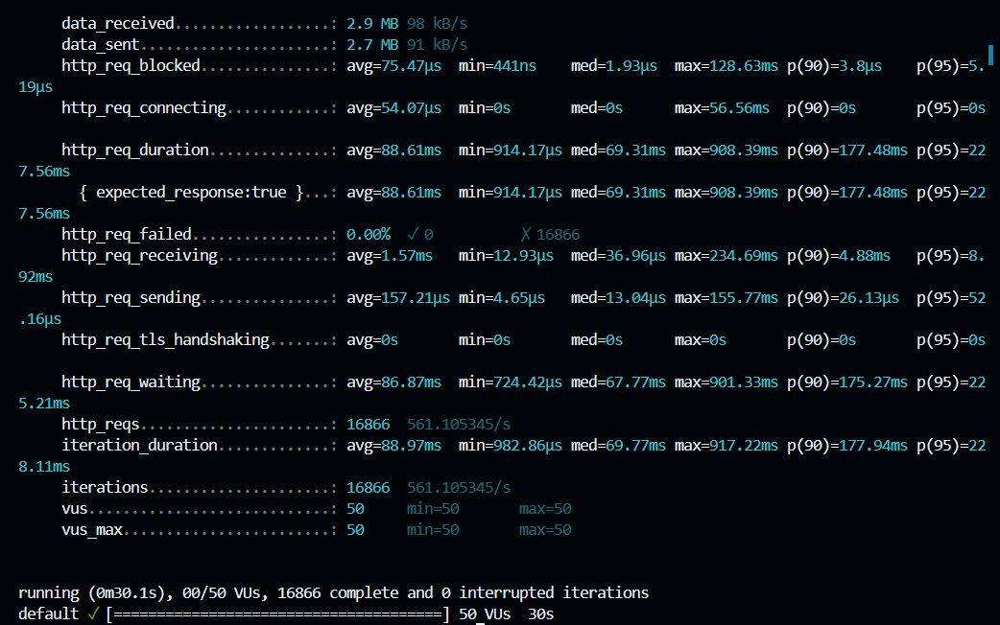
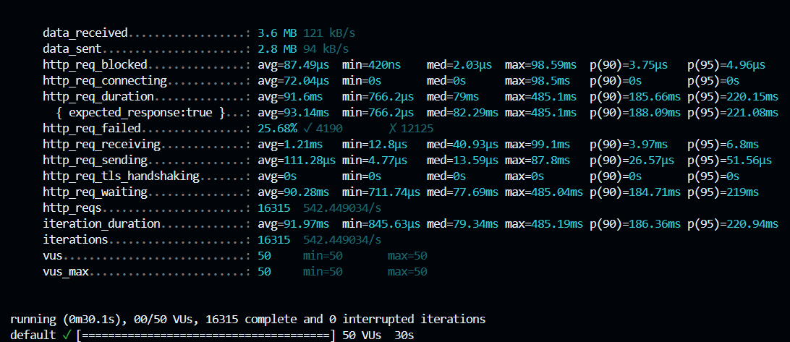

# BancoDB — Controle de Concorrência com JPA/Hibernate

> Projeto acadêmico para demonstração dos problemas de concorrência em sistemas transacionais
> e a solução com **Locking Otimista** usando `@Version` do JPA/Hibernate.

---

## 👥 Integrantes

| Juan Silva |
|-------|-----------------|
| **Aluno A** | Parte 1 — Entidade `ContaBancaria` sem controle de concorrência |
| **Aluno B** | Parte 2 — Entidade `ContaBancariaVersionada` com `@Version` |

---

## Tecnologias

- Java 17
- Spring Boot 3.3
- Spring Web (REST)
- Spring Data JPA / Hibernate
- Banco de dados H2 (em memória)
- K6 (testes de carga)

---

## Como Rodar a Aplicação

### Pré-requisitos
- Java 17+ instalado
- Maven 3.6+ instalado

### 1. Clonar o repositório
```bash
git clone https://github.com/JuanSilva078/bancodb.git
cd bancodb
```

### 2. Executar
```bash
mvn spring-boot:run
```

### 3. Acessar
- API: `http://localhost:8080`
- Console H2: `http://localhost:8080/h2-console`
  - JDBC URL: `jdbc:h2:mem:bancodb`
  - User: `sa` | Senha: *(vazia)*

---

## 📡 Endpoints da API

### Parte 1 — Sem Controle de Concorrência

| Método | Endpoint | Descrição |
|--------|----------|-----------|
| `GET` | `/contas/{id}` | Consulta conta pelo ID |
| `POST` | `/contas/{id}/deposito` | Deposita valor na conta |
| `POST` | `/contas/{id}/saque` | Saca valor da conta |

### Parte 2 — Com Locking Otimista (`@Version`)

| Método | Endpoint | Descrição |
|--------|----------|-----------|
| `GET` | `/contas-versionadas/{id}` | Consulta conta versionada pelo ID |
| `POST` | `/contas-versionadas/{id}/deposito` | Deposita (com proteção de versão) |
| `POST` | `/contas-versionadas/{id}/saque` | Saca (com proteção de versão) |

---

## 🔬 Testes de Carga com K6

### Configuração
- **Ferramenta:** K6
- **Usuários virtuais:** 50
- **Duração:** 30 segundos por teste
- **Operação:** Depósito de R$ 10,00 simultâneo na mesma conta

---

## Relatório de Conclusão

### Parte 1 — O Problema: Lost Update (Sem Controle de Concorrência)

**Endpoint testado:** `POST /contas/1/deposito`

| Métrica | Resultado |
|---------|-----------|
| Total de requisições | 16.866 |
| Requisições com erro | 0% |
| Tempo médio de resposta | 88.61ms |

**Resultado do K6:**



**Análise:**
Todas as 16.866 requisições retornaram HTTP 200 OK, aparentando sucesso total. Porém, ao consultar o saldo final da conta, o valor estava **R$ 50.280,00** — muito abaixo do esperado **R$ 170.660,00** (1.000 inicial + 16.866 depósitos × R$ 10). Isso significa que **R$ 120.380,00 foram perdidos** silenciosamente. Esse é o problema clássico do **Lost Update**: múltiplas threads leram o mesmo saldo antes de qualquer uma commitar, sobrescrevendo as atualizações umas das outras. Nenhum erro é reportado, mas os dados ficam corrompidos.

**Saldo final incorreto:**


---

### Parte 2 — A Solução: Locking Otimista com @Version

**Endpoint testado:** `POST /contas-versionadas/1/deposito`

| Métrica | Resultado |
|---------|-----------|
| Total de requisições | 16.315 |
| Requisições com erro (409 Conflict) | 25.68% (4.190 requisições) |
| Requisições bem-sucedidas | 74.32% (12.125 requisições) |
| Tempo médio de resposta | 91.6ms |

**Resultado do K6:**



**Análise:**
Com o `@Version`, o Hibernate incluiu a versão do registro na cláusula WHERE de cada UPDATE. Quando duas transações tentaram commitar com a mesma versão, apenas uma foi aceita — a outra recebeu `ObjectOptimisticLockingFailureException`, tratada pelo controller como **HTTP 409 Conflict**. O saldo final foi **R$ 122.250,00**, que corresponde exatamente a R$ 1.000 + 12.125 depósitos bem-sucedidos × R$ 10 = **R$ 122.250,00**. Nenhuma atualização foi perdida.

**Saldo final correto:**


---

### Comparativo Final

| Aspecto | Sem Controle (Parte 1) | Com @Version (Parte 2) |
|---------|----------------------|----------------------|
| Total de requisições | 16.866 | 16.315 |
| Taxa de erro | 0% | 25.68% |
| Tipo de erro | Nenhum (silencioso) | HTTP 409 Conflict |
| Saldo esperado | R$ 170.660,00 | R$ 122.250,00 |
| Saldo final obtido | R$ 50.280,00 ❌ | R$ 122.250,00 ✅ |
| Valor perdido | R$ 120.380,00 | R$ 0,00 |
| Integridade dos dados | Comprometida | Garantida |

**Conclusão:**
O teste evidencia claramente a diferença entre as duas abordagens. Sem controle de concorrência, o sistema aparenta funcionar normalmente mas corrompe os dados silenciosamente — R$ 120.380,00 foram perdidos sem nenhum erro reportado. Com o Locking Otimista, os conflitos são detectados e reportados explicitamente via HTTP 409, garantindo integridade total dos dados sem locks pessimistas no banco, mantendo boa performance mesmo sob alta carga.